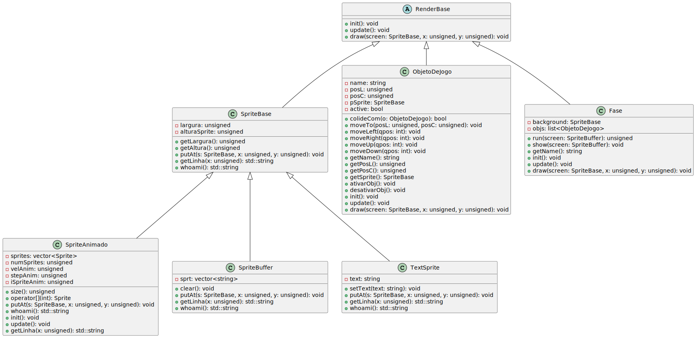

# Documentation-Engine
Registrar a Engine do Prof. Victor A. P. de Oliveira, na disciplina de POO em C++, no IFPB, é essencial para divulgar o conhecimento na Engenharia de Computação.

# Tutorial de como usar a Engine
Na sua primeira implementação básica é possivel que gere um erro, com isso, podendo não monstrar sua funcionalidade ou que execute apenas dando um aviso.    
  

~~~c++
g++ -o game .cpp ASCII_Egine/.cpp && ./game
~~~
1. Explicação do comando: O "g++" Invoca o compilador gcc, "-o game" define o nome do executavel como "game"(O nome "game" pode ser o de sua preferência), *.cpp ASCII_Engine/.cpp são os arquivos que serão compilados. O código-fonte do programa está em um arquivo chamado .cpp e também em arquivos na pasta ASCII_Engine/.  

2. Execução:
&& ./game: Se a compilação for bem-sucedida (sem erros), o programa será executado. O && é um operador que indica que o próximo comando será executado se o anterior for executado sem erros. ./game é o comando que executa o programa compilado.    

Você pode lidar com esses avisos/erros de duas maneiras, uma delas é deletando os arquivos da classe sound(.cpp e o .hpp) 
1. Primeiro você entre no diretorio onde está a Engine e execute esse comando:

~~~c++ 
rm Sound.cpp Sound.hpp
~~~

Após fazer isso você pode checar se os arquivos foram excluídos com o comando:
~~~c++
tree
~~~

Tendo feito isso, execute o arquivo do seu jogo novamente:
~~~c++
./game
~~~

